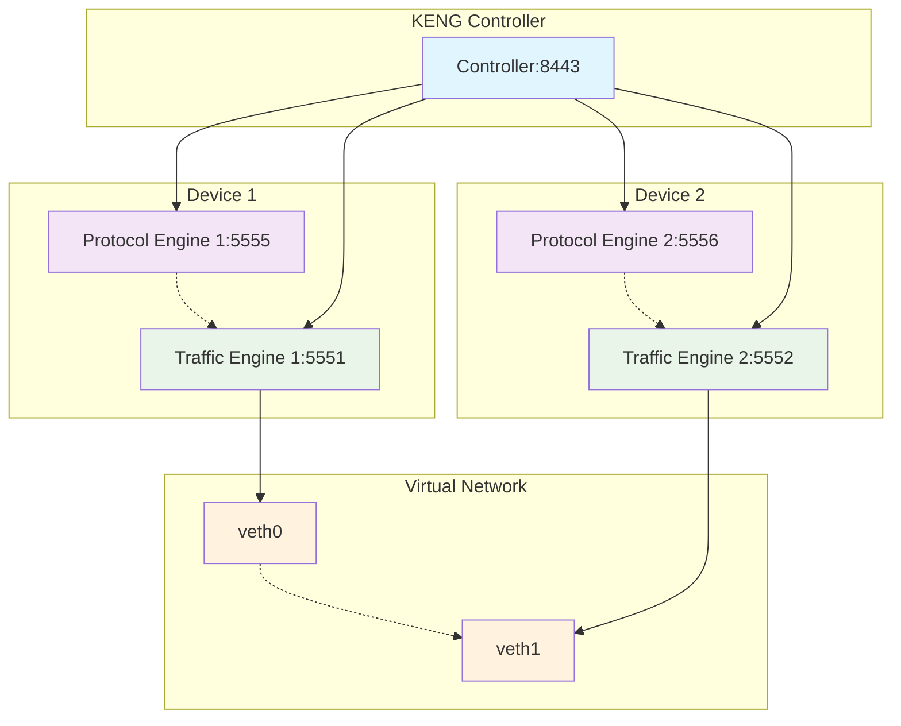

# Lab 02: Docker Back-to-Back Testing with Protocol Engine

## 🎯 Overview
This lab uses **snappi** to control the free **Ixia-c Community Edition** (OTG Test Tool) which is deployed via **Docker Compose orchestration** and utilized to create BGP peers and send traffic in a back-to-back topology. This lab consists of:
- **1x KENG Controller** container
- **2x Ixia-c Traffic Engine** containers  
- **2x Ixia-c Protocol Engine** containers

## 🎓 Learning Objectives
By the end of this lab, you will be able to:
- Deploy Ixia-c containers using Docker Compose orchestration
- Configure BGPv4 peering between protocol engines
- Advertise IPv4 and IPv6 unicast prefixes via BGP
- Create bidirectional device flows using BGP routes as sources/destinations
- Validate BGP session establishment and route learning
- Verify traffic transmission with zero packet loss
- Capture and analyze network packets for troubleshooting

## 📋 Prerequisites
- Completion of Lab 01 (Docker Back-to-Back Testing)
- Understanding of BGP routing protocol fundamentals
- Docker and Docker Compose installed and running
- Python 3.8+ with snappi package installed
- sudo privileges for network interface creation
- Basic knowledge of IPv4 and IPv6 addressing

## 🏗️ Lab Architecture

*If image is not available, here's the architecture diagram:*

**New Components:**
- **Protocol Engine 1** (Port 5555): Emulates network protocols on device 1
- **Protocol Engine 2** (Port 5556): Emulates network protocols on device 2

## 📊 Test Specifications
- **Protocol Emulation**: BGPv4 peering between two virtual routers
- **Route Advertisement**: IPv4 and IPv6 unicast prefixes per BGP peer
- **Traffic Pattern**: Bidirectional device flows using BGP-learned routes
- **Traffic Validation**: Zero packet loss verification
- **BGP Validation**: Session establishment and route learning verification
- **Packet Capture**: Network packet analysis for troubleshooting
- **Orchestration**: Docker Compose deployment and management

## 🎯 Key Differences from Lab 01
| Aspect | Lab 01 | Lab 02 |
|--------|--------|--------|
| **Traffic Type** | Raw packets | BGP protocol-aware flows |
| **Containers** | 3 (Controller + 2 Traffic Engines) | 5 (+ 2 Protocol Engines) |
| **Deployment** | Docker commands | Docker Compose orchestration |
| **Protocols** | None | BGPv4 with IPv4/IPv6 routes |
| **Validation** | Basic traffic stats | BGP sessions + zero packet loss |
| **Analysis** | Port metrics only | Packet captures + protocol analysis |

## 🔬 Lab Test Actions
This test includes traffic and protocol emulation and performs the following actions:
- **BGP Peer Creation**: Creates one BGPv4 peer on each pair of PE+TE containers
- **Route Advertisement**: Both peers advertise several IPv4 and IPv6 unicast prefixes
- **Device Flow Creation**: Bidirectional flows are created using BGP routes as sources and destinations
- **Protocol Validation**: Validates that BGP peering gets established and routes are being received
- **Traffic Validation**: Ensures traffic has no packet loss
- **Packet Analysis**: Packet captures will be taken for network analysis

## 🎯 Expected Learning Outcomes
After completing this lab, you will understand:
- Docker Compose orchestration for complex OTG deployments
- BGPv4 protocol configuration and session establishment
- IPv4 and IPv6 route advertisement and learning processes
- Device-based traffic flows using protocol-learned routes
- Zero packet loss validation techniques
- Packet capture analysis for network troubleshooting
- Integration of protocol and traffic engines for realistic testing

---

**🎯 Success Criteria:**
- All 5 containers deployed successfully via Docker Compose
- BGPv4 sessions established between PE containers
- IPv4 and IPv6 routes advertised and received correctly
- Bidirectional device flows created using BGP routes
- Zero packet loss achieved in traffic validation
- Packet captures successfully collected and analyzed

Your journey into advanced BGP protocol testing with Docker Compose begins here! 🌟
