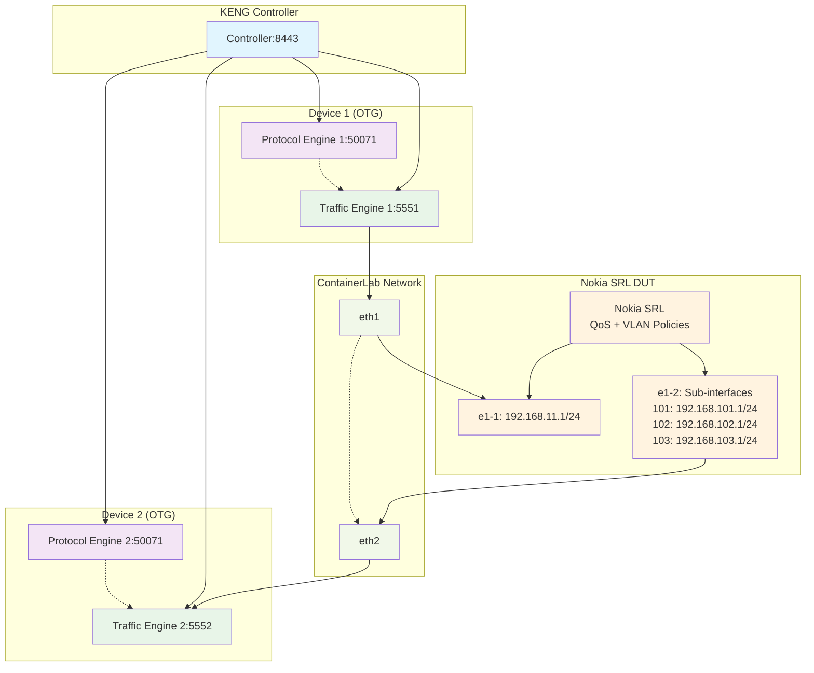

# Lab 03: IxiaC-ContainerLab-DUT-Egress-Tracking

## 🎯 Overview
This lab uses **snappi** to control the free **Ixia-c Community Edition** (OTG Test Tool) which is deployed via **ContainerLab orchestration** and utilized to create sub-interfaces and send traffic to a **DUT (Device Under Test)**. This lab consists of:
- **1x KENG Controller** container
- **2x Ixia-C Traffic Engine** containers  
- **2x Ixia-C Protocol Engine** containers
- **1x Nokia SRL** container (acting as DUT)

## 🎓 Learning Objectives
By the end of this lab, you will be able to:
- Deploy Ixia-c containers with Nokia SRL DUT using ContainerLab orchestration
- Configure IPv4 interfaces and sub-interfaces on OTG ports
- Set up egress tracking to monitor packet transformations through a DUT
- Validate VLAN tag insertion and modification by network devices
- Verify QoS DSCP remarking policies on real network equipment
- Analyze tagged metrics to understand traffic distribution patterns
- Troubleshoot DUT configurations using egress tracking data

## 📋 Prerequisites
- Completion of Lab 01 and Lab 02 (Docker Back-to-Back Testing)
- Understanding of VLAN and QoS/DSCP concepts
- ContainerLab installed and configured
- Docker and Docker Compose running
- Python 3.8+ with snappi package installed
- sudo privileges for ContainerLab deployment
- Basic knowledge of Nokia SRL configuration
- Understanding of egress tracking fundamentals

## 🏗️ Lab Architecture


*If image is not available, here's the architecture diagram:*



**Key Components:**
- **Nokia SRL DUT**: Real network device performing packet transformations
- **Egress Tracking**: Monitors packet modifications (VLAN, DSCP) through the DUT
- **Sub-interfaces**: Multiple VLAN-tagged receive endpoints (101, 102, 103)
- **QoS Policies**: DSCP remarking from 10 (AF11) to 20 (AF22)

## 📊 Test Specifications
- **DUT Integration**: Nokia SRL performing VLAN tagging and QoS remarking
- **Egress Tracking**: Monitor VLAN ID insertion and DSCP value modifications
- **Sub-interface Testing**: Traffic distribution across multiple VLAN sub-interfaces
- **QoS Validation**: DSCP remarking policy verification (10 → 20)
- **Traffic Pattern**: Untagged ingress → Tagged egress with QoS modifications
- **Packet Analysis**: Correlation between egress tracking and packet captures
- **Orchestration**: ContainerLab deployment with real network device integration

## 🎯 Key Differences from Previous Labs
| Aspect | Lab 01 | Lab 02 | Lab 03 |
|--------|--------|--------|--------|
| **Focus** | Basic B2B traffic | BGP protocol testing | DUT validation + egress tracking |
| **Containers** | 3 (Controller + 2 TEs) | 5 (+ 2 PEs) | 6 (+ Nokia SRL DUT) |
| **Deployment** | Docker commands | Docker Compose | ContainerLab orchestration |
| **DUT** | None | None | Nokia SRL network device |
| **Tracking** | Basic flow metrics | Protocol + flow metrics | Egress tracking + tagged metrics |
| **Validation** | Packet counts | BGP sessions + traffic | DUT transformations + QoS policies |
| **Analysis** | Port metrics | Packet captures + protocols | Egress correlation + DUT validation |

## 🔬 Lab Test Actions
This test includes traffic generation, DUT interaction, and egress tracking validation:

### **Traffic Generation:**
- **IPv4 Interface Creation**: Creates IPv4 interfaces and sub-interfaces on OTG ports
- **Untagged Traffic Transmission**: Sends untagged packets from Device 1 to Nokia SRL
- **Multiple DSCP Values**: Transmits packets with DSCP values [10, 14, 22, 24]

### **DUT Processing:**
- **VLAN Tag Insertion**: Nokia SRL adds VLAN tags (101, 102, 103) to received packets
- **QoS DSCP Remarking**: Applies QoS policies to remark DSCP 10 → DSCP 20
- **Traffic Distribution**: Distributes traffic across multiple sub-interfaces

### **Egress Tracking Validation:**
- **VLAN ID Tracking**: Monitors which VLAN IDs are added to packets
- **DSCP Value Tracking**: Validates QoS remarking policies
- **Distribution Analysis**: Analyzes traffic spread across sub-interfaces
- **Tagged Metrics Collection**: Gathers detailed statistics per tracked field

## 🎯 Expected Learning Outcomes
After completing this lab, you will understand:
- ContainerLab orchestration for complex network topologies with real devices
- Egress tracking configuration and analysis in OTG/KENG environments
- VLAN sub-interface configuration and traffic distribution patterns
- QoS policy validation using automated egress tracking
- DUT integration testing methodologies for network validation
- Correlation techniques between packet captures and egress tracking data
- Advanced troubleshooting using tagged metrics and field-specific analysis
- Real-world network device testing scenarios and best practices

## 🔍 Egress Tracking Deep Dive
This lab demonstrates the power of **egress tracking** - a unique OTG/KENG capability that automatically monitors packet field modifications:

### **What Gets Tracked:**
- **VLAN ID Changes**: Monitors VLAN tag insertion (None → 101/102/103)
- **DSCP Modifications**: Tracks QoS remarking (10 → 20, others → 0)
- **Traffic Distribution**: Analyzes packet spread across multiple receive endpoints

### **Why Egress Tracking Matters:**
- **Automated Validation**: No manual packet capture analysis required
- **Real-time Monitoring**: Live tracking during test execution
- **Statistical Analysis**: Detailed metrics per tracked field value
- **DUT Verification**: Validates that network devices perform expected transformations

### **Traditional vs. Egress Tracking:**
```
Traditional Testing:
[TX: 1000 packets] → [DUT] → [RX: 1000 packets] ✓ Basic connectivity

Egress Tracking:
[TX: 1000 untagged] → [DUT] → [RX: 333 VLAN 101 + 333 VLAN 102 + 334 VLAN 103] ✓ Detailed transformation validation
```

---

**🎯 Success Criteria:**
- All 6 containers deployed successfully via ContainerLab
- Nokia SRL DUT configured with VLAN sub-interfaces and QoS policies
- Egress tracking successfully monitors VLAN ID insertion
- DSCP remarking validation shows 75% of packets remarked (DSCP 10 → 20)
- Traffic distribution analysis across multiple sub-interfaces
- Correlation between egress tracking results and packet captures

Your journey into advanced DUT testing with egress tracking begins here! 🌟