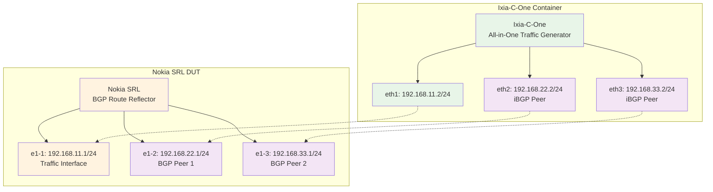

# Lab 04: IxiaC-ContainerLab-DUT-Convergence

## 🎯 Overview
This lab uses **snappi** to control the free **Ixia-c Community Edition** (OTG Test Tool) which is deployed via **ContainerLab orchestration** and utilized to create sub-interfaces and send traffic to a **DUT (Device Under Test)**. This lab consists of:
- **1x Ixia-C-One** container (all-in-one traffic generator)
- **1x Nokia SRL** container (acting as DUT)

## 🎓 Learning Objectives
By the end of this lab, you will be able to:
- Deploy Ixia-C-One all-in-one container using ContainerLab orchestration
- Configure iBGP peering through a DUT for convergence testing
- Create IPv4 unicast prefix advertisements for route learning
- Generate bidirectional flows using BGP-learned routes as sources and destinations
- Validate BGP session establishment and route reception with zero packet loss
- Test network convergence scenarios with link failure and route withdrawal events
- Measure convergence time and analyze traffic recovery patterns
- Understand the difference between hard failures (link down) and soft failures (route withdrawal)

## 📋 Prerequisites
- Completion of Lab 01, Lab 02, and Lab 03 (Docker and BGP fundamentals)
- Understanding of BGP protocol concepts and convergence principles
- ContainerLab installed and configured
- Docker and Docker Compose running
- Python 3.8+ with snappi package installed
- sudo privileges for ContainerLab deployment
- Basic knowledge of Nokia SRL configuration
- Understanding of network convergence and failover concepts

## 🏗️ Lab Architecture


*If image is not available, here's the architecture diagram:*



**Key Components:**
- **Ixia-C-One**: All-in-one container with integrated controller, traffic engines, and protocol engines
- **iBGP Configuration**: Internal BGP peering between eth2/eth3 and Nokia SRL
- **Route Advertisement**: Both BGP peers advertise the same IPv4 prefixes with different attributes
- **Convergence Testing**: Link down and route withdrawal events to test network recovery

## 📊 Test Specifications
- **Protocol Emulation**: iBGP peering with route advertisement and traffic generation
- **BGP Configuration**: Internal BGP with Local Preference and MED attributes
- **Route Advertisement**: IPv4 unicast prefixes advertised by both BGP peers
- **Traffic Pattern**: Bidirectional flows using BGP-learned routes as destinations
- **Convergence Events**: Link failure simulation and route withdrawal testing
- **Recovery Analysis**: Convergence time measurement and traffic loss analysis
- **Orchestration**: ContainerLab deployment with all-in-one traffic generator

## 🎯 Key Differences from Previous Labs
| Aspect | Lab 01 | Lab 02 | Lab 03 | Lab 04 |
|--------|--------|--------|--------|--------|
| **Focus** | Basic B2B traffic | BGP protocol testing | Egress tracking | BGP convergence testing |
| **Containers** | 3 (Controller + 2 TEs) | 5 (+ 2 PEs) | 6 (+ Nokia SRL) | 2 (Ixia-C-One + Nokia SRL) |
| **Deployment** | Docker commands | Docker Compose | ContainerLab | ContainerLab |
| **Traffic Generator** | Separate components | Separate components | Separate components | All-in-one container |
| **Protocol** | None | eBGP | None (egress tracking) | iBGP with convergence |
| **DUT Role** | None | None | Packet transformation | Route reflection & convergence |
| **Testing Focus** | Connectivity | Protocol establishment | Packet modifications | Network recovery time |

## 🔬 Lab Test Actions
This test includes BGP protocol emulation, traffic generation, and convergence validation:

### **BGP Protocol Configuration:**
- **iBGP Peer Creation**: Creates iBGP peers on eth2 and eth3 interfaces
- **Route Advertisement**: Both peers advertise several IPv4 unicast prefixes
- **Attribute Configuration**: Sets BGP Local Preference and MED values for path selection
- **Route Reflection**: Nokia SRL acts as route reflector for iBGP peers

### **Traffic Generation:**
- **Bidirectional Flows**: Creates flows using BGP-learned routes as sources and destinations
- **Route-Based Traffic**: Traffic follows BGP best path selection
- **Continuous Monitoring**: Real-time traffic monitoring during convergence events

### **Convergence Testing:**
- **Link Down Event**: Simulates physical link failure to trigger convergence
- **Route Withdrawal**: Soft failure through BGP UPDATE messages
- **Recovery Measurement**: Calculates convergence time based on packet loss and recovery
- **Traffic Analysis**: Monitors traffic path changes during convergence events

## 🎯 Expected Learning Outcomes
After completing this lab, you will understand:
- ContainerLab orchestration with all-in-one traffic generators
- iBGP configuration and route reflection concepts
- BGP path selection with Local Preference and MED attributes
- Network convergence principles and measurement techniques
- Difference between hard failures (link down) and soft failures (route withdrawal)
- Convergence time calculation methodologies
- Traffic pattern analysis during network recovery
- Production-ready network resilience testing approaches

## 🔍 Convergence Testing Deep Dive
This lab demonstrates advanced **network convergence testing** capabilities:

### **What Gets Tested:**
- **BGP Session Recovery**: How quickly BGP sessions recover after failure
- **Route Convergence**: Time for routing table updates and path selection
- **Traffic Recovery**: Actual data plane recovery and packet forwarding restoration
- **Path Selection**: BGP best path algorithm during failure scenarios

### **Why Convergence Testing Matters:**
- **Network Resilience**: Validates network's ability to recover from failures
- **SLA Compliance**: Ensures recovery times meet service level agreements  
- **Capacity Planning**: Understanding failure impact on network performance
- **Operational Readiness**: Validates network behavior before production deployment

### **Types of Convergence Events:**
```
Hard Failure (Link Down):
[BGP Peer 1] --X-- [DUT] ---- [BGP Peer 2] → Physical link failure

Soft Failure (Route Withdrawal):
[BGP Peer 1] ~~~~ [DUT] ---- [BGP Peer 2] → BGP UPDATE withdrawal
```

## 🎯 Convergence Metrics Analysis

### **Key Metrics Measured:**
- **Detection Time**: How quickly the failure is detected
- **Convergence Time**: Total time for network to converge to new state
- **Packet Loss**: Number of packets lost during convergence
- **Recovery Pattern**: Traffic flow changes during recovery

### **Calculation Method:**
```
Convergence Time = (Lost Packets ÷ Transmission Rate) seconds

Example:
- Lost Packets: 50
- Transmission Rate: 100 pps
- Convergence Time: 50 ÷ 100 = 0.5 seconds
```

---

**🎯 Success Criteria:**
- All 2 containers deployed successfully via ContainerLab
- iBGP sessions established between Ixia-C-One and Nokia SRL
- IPv4 routes advertised and received correctly with proper attributes
- Bidirectional flows created using BGP-learned routes
- Zero packet loss achieved during steady-state operation
- Convergence events successfully trigger network recovery
- Convergence time measured and analyzed for both link down and route withdrawal scenarios

Your journey into advanced network convergence testing begins here! 🌟